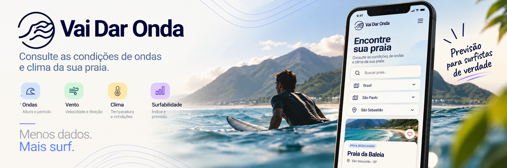

<p align="center">
  
</p>

# Apresentação do projeto + Guia do Usuário

## 📌 Apresentação do projeto

O **VAI DAR ONDA** é uma aplicação web desenvolvida com o objetivo de facilitar a consulta e a interpretação das condições do mar para a prática do surf.

A aplicação busca transformar informações técnicas de previsão, como condições das ondas, vento e temperatura, em informações mais simples e acessíveis para o usuário.

O projeto foi desenvolvido no contexto da disciplina **Prática Profissional de ADS**, do curso de **Análise e Desenvolvimento de Sistemas da Universidade Presbiteriana Mackenzie**.

### 🎯 Objetivo

O principal objetivo do VAI DAR ONDA é permitir que o usuário consulte as condições de uma determinada praia de forma rápida e intuitiva, facilitando a compreensão das informações necessárias para avaliar as condições do mar.

A aplicação deverá permitir que o usuário:

* busque uma praia pelo nome;
* selecione uma praia para consulta;
* visualize as condições das ondas;
* visualize informações sobre o vento;
* consulte a temperatura;
* visualize o índice de surfabilidade;
* consulte informações de previsão;
* salve uma praia como favorita;
* consulte posteriormente suas praias favoritas.

A consulta de uma praia **não depende de ela estar salva como favorita**. O usuário poderá pesquisar e consultar qualquer praia disponível no sistema, enquanto o recurso de favoritos serve para facilitar o acesso posterior às praias de interesse.

### 👥 Público-alvo

O sistema é destinado principalmente a:

* surfistas iniciantes;
* surfistas intermediários;
* surfistas experientes;
* escolas de surf;
* pessoas interessadas em consultar as condições do mar.

### 📍 Contexto

Informações sobre previsão do mar podem envolver diversos dados técnicos, como altura, período e direção das ondas, além de velocidade e direção do vento e temperatura.

O VAI DAR ONDA busca organizar essas informações em uma interface mais simples, permitindo que o usuário compreenda as condições da praia sem precisar interpretar individualmente cada informação técnica.

---

# 📖 Guia do Usuário

---

## 1. Acessando a aplicação

### Como acessar
Acesse através do endereço oficial da plataforma: `https://mayyarrud.github.io/trabalho-prat-prof/`.

### Requisitos
Navegador web moderno com conexão à internet. A plataforma foi desenhada no modelo *mobile-first*, recomendando-se o uso em dispositivos móveis para a melhor experiência.

### Status
**MVP Disponível.**

---

## 2. Cadastro de usuário

### Objetivo
Permitir que um novo usuário crie uma conta para utilizar as funcionalidades que exigem autenticação.

### Como acessar
Na tela inicial, selecione a opção "Fazer cadastro" ou clique em "Criar sua conta".

### Passo a passo
1. Acesse o formulário de cadastro.
2. Insira o seu Nome e E-mail.
3. Defina uma Senha (mínimo de 6 caracteres).
4. Selecione o seu "Nível de Surf" (ex: Intermediário).
5. Confirme o cadastro.

### Resultado esperado
Conta criada com sucesso e usuário redirecionado para a plataforma autenticada.

### Status
**Funcionalidade MVP / Em validação.**

---

## 3. Login

### Objetivo
Permitir que usuários cadastrados acessem sua conta.

### Como acessar
Através da tela "Acesse sua conta".

### Passo a passo
1. Insira o E-mail e a Senha registrados.
2. Clique no botão "Fazer login".
3. Alternativamente, utilize a opção "Continuar com Google" para acesso rápido.

### Resultado esperado
Autenticação efetuada com sucesso, liberando os recursos de personalização do perfil.

### Status
**Funcionalidade MVP / Em validação.**

---

## 4. Recuperação de senha

### Objetivo
Permitir que o usuário recupere o acesso à sua conta caso esqueça sua senha.

### Como acessar
Na tela de login, clicando no link "Esqueceu sua senha?".

### Passo a passo
1. Clique no link de recuperação.
2. Informe o e-mail cadastrado.
3. Siga as instruções enviadas para a sua caixa de entrada.
4. Cadastre uma nova senha de acesso.

### Resultado esperado
Acesso à conta restaurado com a nova credencial de segurança.

### Status
**Em desenvolvimento.**

---

## 5. Buscar uma praia

### Objetivo
Permitir que o usuário encontre uma praia disponível no sistema.

### Como acessar
Na tela inicial "Encontre sua praia".

### Passo a passo
1. Clique no campo "Buscar praia...".
2. Digite o nome da praia desejada ou utilize os filtros de seleção por País, Estado e Cidade.
3. *(Nota: O MVP apresenta dados de 10 praias selecionadas do litoral de São Paulo, como Barra do Una e Maresias)*.

### Resultado esperado
A praia correspondente é exibida na lista de resultados ou destacada na tela.

### Status
**MVP Disponível.**

---

## 6. Selecionar uma praia

### Objetivo
Permitir que o usuário selecione a praia que deseja consultar.

### Como acessar
A partir da lista de pesquisa ou do card de destaque.

### Passo a passo
1. Encontre a praia desejada nos resultados.
2. Clique sobre o nome ou card da praia.
3. Clique no botão inferior "Ver previsão ->" ou "Ver previsão completa ->".

### Resultado esperado
O sistema redireciona o usuário para a tela detalhada de condições marítimas da praia escolhida.

### Status
**MVP Disponível.**

---

## 7. Consultar as condições da praia

### Objetivo
Apresentar ao usuário as informações disponíveis sobre as condições da praia selecionada.

### Informações previstas
* Condições das ondas;
* Altura das ondas;
* Período das ondas;
* Direção das ondas;
* Velocidade do vento;
* Direção do vento;
* Temperatura;
* Índice de surfabilidade.

### Como acessar
Na tela específica da praia, carregada após a seleção.

### Passo a passo
1. Visualize o quadro "Condições principais" logo abaixo do nome da praia.
2. Consulte as seções detalhadas de "Ondas", com informações de altura, período e direção.
3. Consulte as seções de "Vento" e "Clima" (Temperatura e Condição).

### Resultado esperado
O usuário visualiza os dados técnicos formatados de maneira clara e acessível.

### Status
**MVP Disponível.**

---

## 8. Visualizar o índice de surfabilidade

### Objetivo
Permitir que o usuário visualize uma indicação das condições de surf da praia consultada.

### Como acessar
Exibido em destaque nos cards da praia e no resumo de condições principais.

### Interpretação do índice
O índice resume os dados técnicos em uma classificação textual simples (ex: "Alta"), indicando visualmente se a praia oferece boas condições de ondas e ventos sem que o usuário precise analisar os números brutos.

### Resultado esperado
Compreensão imediata do cenário ideal para o surf, facilitando a tomada de decisão.

### Status
**MVP Disponível.**

---

## 9. Consultar a previsão

### Objetivo
Permitir que o usuário consulte informações relacionadas à previsão das condições do mar.

### Como acessar
Através do menu de abas localizado na tela de detalhes da praia.

### Informações apresentadas
Projeção das condições de onda, vento e clima em diferentes períodos.

### Passo a passo
1. Na tela da praia selecionada, localize as opções de navegação temporal.
2. Clique na aba "Hoje" para verificar as métricas atuais.
3. Selecione a aba "5 dias" para visualizar as estimativas para os dias seguintes.

### Resultado esperado
A interface atualiza automaticamente os blocos de dados climáticos conforme o período escolhido.

### Status
**Funcionalidade MVP.**

---

## 10. Salvar uma praia como favorita

### Objetivo
Permitir que o usuário salve uma praia para facilitar consultas futuras.

### Como acessar
Pelo ícone de "coração" disponível na listagem ou na tela específica da praia.

### Passo a passo
1. Acesse o sistema com sua conta de usuário.
2. Busque e selecione a praia de seu interesse.
3. Clique no ícone de "coração" (♡) para ativá-lo.

### Resultado esperado
A praia é adicionada à lista de praias favoritas do usuário e o ícone passa a ficar preenchido.

### Status
**Funcionalidade MVP / Em validação.**

---

## 11. Consultar praias favoritas

### Objetivo
Permitir que o usuário visualize as praias que salvou como favoritas.

### Como acessar
Através da tela "Meu Perfil".

### Passo a passo
1. Faça login e acesse a aba do seu perfil.
2. Verifique o campo de "Praia favorita".
3. Clique sobre a praia listada para carregar imediatamente a sua previsão.

### Resultado esperado
Acesso rápido e direto às previsões dos locais preferidos do usuário.

### Status
**Funcionalidade MVP / Em validação.**

---

## 12. Meu Perfil

### Objetivo
Permitir que o usuário visualize e gerencie suas informações pessoais cadastradas na aplicação.

### Como acessar
Pela navegação principal, acessando o menu da conta.

### Informações disponíveis
Nível de Surf atual e Praias Favoritas selecionadas.

### Funcionalidades disponíveis
* Visualizar e alterar o Nível de Surf.
* Visualizar a Praia favorita vinculada.
* Salvar alterações de cadastro e Alterar senha de acesso.

### Status
**Funcionalidade MVP / Em validação.**

---

## 13. Sair da aplicação

### Objetivo
Permitir que o usuário encerre sua sessão.

### Como acessar
Através do menu do usuário autenticado.

### Passo a passo
1. Acesse as opções da sua conta.
2. Clique na opção "Sair" ou "Logout".

### Resultado esperado
A conta é desconectada com segurança e o usuário retorna à tela inicial de busca.

### Status
**Em desenvolvimento.**

---

# 🔄 Fluxo básico de utilização

O fluxo principal previsto para utilização da aplicação é:

```text
Acessar a aplicação
        ↓
Buscar uma praia
        ↓
Selecionar a praia
        ↓
Visualizar as condições
        ↓
Consultar a previsão
        ↓
Visualizar o índice de surfabilidade
        ↓
Salvar como favorita (opcional)

O usuário também poderá acessar posteriormente suas praias favoritas:

Login
  ↓
Praias favoritas
  ↓
Selecionar uma praia
  ↓
Visualizar condições
```

# 📝 Atualizações do Guia
Esta documentação será atualizada conforme as funcionalidades forem implementadas, testadas e disponibilizadas na aplicação.

Funcionalidades ainda não implementadas permanecerão identificadas como “Em desenvolvimento” até que possam ser documentadas com o passo a passo definitivo.
